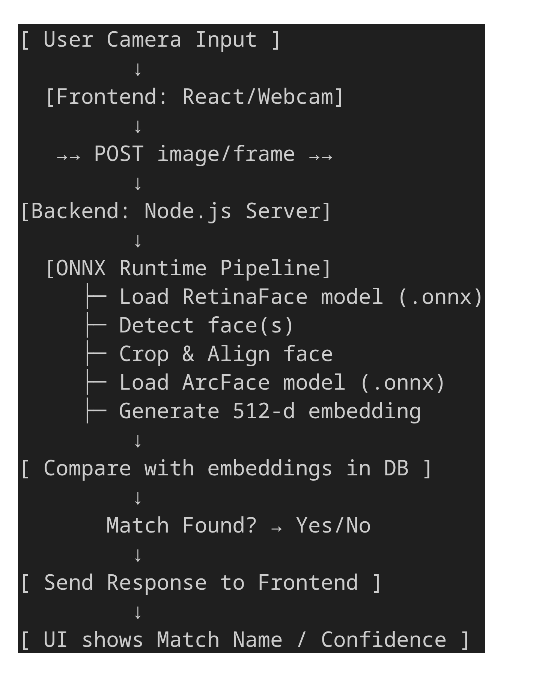

## Flow of the Software

[ User Camera Input ]
         ↓
  [Frontend: React/Webcam]
         ↓
   →→ POST image/frame →→
         ↓
[Backend: Node.js Server]
         ↓
  [ONNX Runtime Pipeline]
     ├─ Load RetinaFace model (.onnx)
     ├─ Detect face(s)
     ├─ Crop & Align face
     ├─ Load ArcFace model (.onnx)
     ├─ Generate 512-d embedding
         ↓
[ Compare with embeddings in DB ]
         ↓
       Match Found? → Yes/No
         ↓
[ Send Response to Frontend ]
         ↓
[ UI shows Match Name / Confidence ]

## New updated flow

[ User Camera Input ]
         ↓
  [Frontend: React/Webcam]
         ↓
  →→ Open Socket.io connection →→
         ↓
  →→ Stream image frames via Socket.io →→
         ↓
[Backend: Node.js Server with Socket.io Server]
         ↓
  [ONNX Runtime Pipeline]
     ├─ Load RetinaFace model (.onnx)
     ├─ Detect face(s)
     ├─ Crop & Align face (sharp)
     ├─ Load ArcFace model (.onnx)
     ├─ Generate 512-d embedding
         ↓
[ Compare with embeddings in DB ]
         ↓
       Match Found? → Yes/No
         ↓
[ Send recognition results back to frontend via WebSocket ]
         ↓
[ Frontend UI updates instantly with Match Name / Confidence ]   

## Current Flow:
Browser (Webcam + base64 image every 300ms)
    └─ emits to backend (Socket.IO / API)
        └─ Backend decodes + runs face-api.js
            └─ Matches face and marks attendance

## Flow For CCTV
CCTV RTSP Camera
        ↓
   [Node Backend]
    - ffmpeg converts RTSP → MJPEG
    - Extract frames for face detection
    - Broadcast both:
        → MJPEG stream to frontend  tag
        → Face box data via socket.io

        ↓                ↓
     socket.on("boxes")
        ↓                ↓
     shows video     overlays boxes
